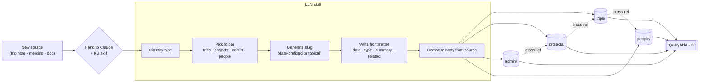

For years I have been telling myself I should keep a real personal knowledge
base. Not just a `~/notes/` folder, not just whatever lives in my email, but
something I would actually consult — a place where past trips, projects, and
meetings cohere into something I can search. Today I sat down and built one.
The interesting parts were not the writing; they were the small design
decisions that make a KB pleasant to live with versus painful to maintain.

Three bodies of content went in. A **trips** corpus, with about a dozen
reports spanning roughly the last three years and a handful of person pages
for the colleagues I have traveled with most. A **projects** corpus, a clean
topical index covering the half-dozen efforts I either lead or contribute to.
And a sprawling **admin** corpus — budget, committees, evaluations, events,
HR — that, by the time I stopped, was easily seventy documents. Three
different shapes of knowledge, glued together with the same handful of
conventions.

## Folders, tags, slugs

The first decision was the cheapest one to get wrong: folders versus tags. I
picked folders. Folders are honest about exclusivity — a trip report is a
trip report, not also a meeting note — and they survive being moved around
with `mv` and `git`. Tags I reserved for cross-cutting attributes inside
frontmatter: who attended, which project the work funded, what topic. The
lesson from years of pure-tag systems is that without a strong default
surface, a KB becomes a tag soup where nothing is _anywhere_.

Slugs got the next bit of thought. Date-prefixed slugs sort correctly in a
file listing, make name collisions almost impossible, and let me see "March
2024" without opening the file. The cost is that the slug stops being a pure
topic — it carries metadata in its name. I am fine with that trade. For
topical entries (projects, people) I dropped the date entirely and let the
name carry the whole signal.

Frontmatter became the load-bearing thing. Every page has a date, a type, a
list of related slugs, and a one-line summary. Most of the value sits in the
summary — when an LLM helper later has to decide whether a page is relevant,
it reads the summary first and reads the body only if the answer is yes.
Keeping summaries to one line forces them to actually be informative.

## A chronological log and a topical index

What I did not appreciate until late in the day was how much I needed _both_
views. Trips and meetings want a chronological log — the natural question is
"what happened in March?" Projects and people want a topical index — the
natural question is "what do I know about X?" The two halves cross-reference
each other heavily (a person page points to the trips they were on; a
project page lists the events tied to it), but they are queried differently
and they are written differently. Mixing them into a single shape would have
flattened both.

## Letting the workflow live in a skill

The most useful single move was packaging the update workflow into a small
LLM skill — a bundle of instructions that knows my folder layout, my slug
rules, and the frontmatter contract. After that, the protocol for adding new
material became: hand the source to the model, let the skill route it. The
friction of _adding_ a new entry, which is what kills most personal KBs,
dropped to roughly the cost of one paragraph of context. That, more than
anything else, is what made today's bulk import tolerable. Without the
skill I would have made it through trips, possibly projects, and given up
halfway through admin.

The whole pipeline, from a stray source to a cross-referenced page in the
KB, looks like this:

<small><em>Drag to pan · scroll to zoom</em></small>

The boxed middle is the part the skill encodes. Everything outside it is
either me (handing in a source on the left) or me later (querying on the
right).

It also shifted what I have to remember. I no longer have to remember the
conventions; I have to remember to _use the skill_. That is a much cheaper
kind of remembering.

## Completeness versus friction

There is a permanent tension between making a KB complete and making it
cheap to maintain. Today I leaned toward completeness — I wanted enough mass
that the cross-references between pages would actually be useful — at the
cost of writing some pages that are essentially placeholders. I think that
was right. An empty KB is worse than a thin KB, because an empty KB does not
give a future search anything to surface.

## The privacy line

The KB is private. This site is public. The two have to stay clearly
separated, and the cheapest way to enforce that is to keep them in different
repositories with different visibility, and to write _about_ the KB on the
public side rather than _from_ it. This post is an example of what should
cross the line: design decisions, methodology, things I would tell a friend.
What should not cross it: names, numbers, anything that belongs to someone
else.

## What I would do differently

Two things, mostly. I would write the skill before the content, not after.
I built the skill once I noticed I was repeating myself, but by then I had
done enough manual entries to introduce small inconsistencies that I will
have to clean up later. And I would resist the urge to start with admin.
Admin is the _broadest_ category but the one with the loosest natural
structure; starting with trips, which have a strong inherent shape, would
have given me a template to push against everything else.

The thing I am most curious about is whether tomorrow-me actually opens the
KB. The honest answer is that the test is not whether I built it well — it
is whether I add to it next week without being prompted. We will see.
