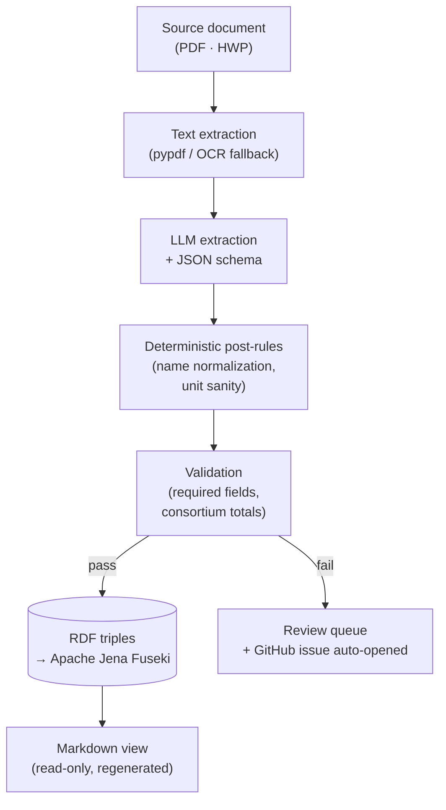
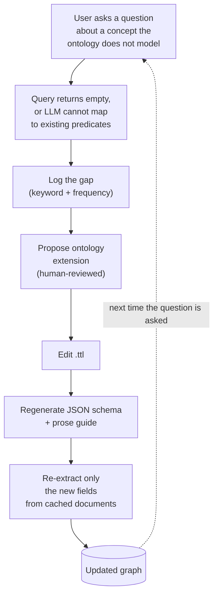

  

[Two days ago]()
I built a markdown knowledge base in an afternoon and called it good. Folders,
slugs, frontmatter, a small skill that knew where things went. The
bootstrap worked exactly as I hoped - by the end of the day there was enough
content for cross-references to start feeling useful.

The trouble is that the day after the bootstrap, I started asking the KB
real questions. _Show me every project that received funding through a
specific agency. Who traveled with me to that country, and which projects
were they on at the time? What is our institute's total contribution across
the active projects?_ Each of these is one or two lines of SQL against a
relational store, and I had built a pile of markdown files instead. So I
spent today turning the KB into something that can answer those questions,
and the interesting parts - again - were the decisions, not the typing.

A note before going further. What started as a personal KB has, in the
process of solving these problems properly, slid in the direction of a small
operating system: an extraction pipeline, a graph store, an MCP server, a
GitHub issue queue, a schema-evolution loop. The texture of the work has
changed even if the surface still looks like "I am keeping some notes." I
think that is honest about what useful knowledge bases actually become
when you take their questions seriously.

## Why bother

The argument for keeping a personal KB in markdown is that markdown is
honest: a human writes it, a human reads it, and a single text editor closes
the loop. The argument for promoting it to a knowledge graph is that the
moment you want _structured_ answers - counts, joins, ranges, aggregations -
markdown is the wrong shape. You end up either greping with regular
expressions, or you write a small parser that pulls structured fields out of
frontmatter, at which point you have built a brittle ad-hoc query layer.
A graph just _is_ that query layer, with a real query language.

So the goal for the day was to keep the markdown - it remains the thing I
read in Obsidian - but to add a second representation underneath: an RDF
graph in [Apache Jena Fuseki](https://jena.apache.org/documentation/fuseki2/),
that the same content can be reduced to, queryable by both me and any
assistant I point at it via an MCP server.

## The four architectural calls

### 1. Markdown as truth, or ontology as truth?

The first instinct is to keep markdown as the source of truth and treat the
graph as a derived view. It is the path of least resistance: I already have
the markdown, I already have a frontmatter convention, and a small script
can flatten that into RDF triples.

The instinct is wrong. The problem is not the conversion script; the problem
is that markdown frontmatter is _whatever the writer felt like at the time_.
On day one I had three projects whose `role` field was the empty string and
three more where it was the Korean word for "lead." The script tried to
honor both, and ended up generating triples that said the same institute
was both a lead and a member of the same project - a contradiction the graph
happily accepted because the script gave it no reason not to. Every cleanup
since then has been a variant of the same shape: the markdown was too loose
to be a source of truth, and the graph inherited every ambiguity.

The correct answer, the one I am committing to over the next week, is to
flip it. The **ontology is the truth** for the queryable layer. The
**document** the ontology was extracted from - the PDF, the HWP, the
spreadsheet - is the upstream truth, the canonical artifact. The markdown
is a generated, read-only view for human eyes. If a fact needs to change,
it changes in the document or in the graph directly; the markdown is
downstream of both.

This sounds severe, but it dissolves a class of bugs the moment it lands.
You cannot have two normalizations of the same institute name in the graph
because the graph is built by code that runs `clean_org_name()` exactly
once. You cannot accidentally assert that the wrong agency funded a
project because the field never existed as plain text for someone to type
inconsistently into.

### 2. What does "the characteristics of a document" even mean - and where do you represent them?

This is where the two layers actually diverge in their expressive power,
and it is worth being precise about. Both markdown frontmatter and an OWL
ontology can hold "the characteristics of a project." But they hold them
differently.

Markdown frontmatter is **flat key-value**. A project page has a `keti_pi`
field that holds one name. A `consortium` field that holds a list. A
`budget` field that holds a number. This works fine until the relationship
you want to record has _its own attributes_. A consortium membership is
not just "organization X is in the consortium"; it is "organization X is
in the consortium with role Y, and their principal investigator is
person Z, and their share of the budget is amount W." Flatten that into
frontmatter and you end up with `consortium: [{name, role, pi, share},
…]` - already a step toward structured data, but a step that the YAML
parser will not enforce and that the next person to edit the file will
quietly diverge from.

An ontology models the same fact as a small graph: a Project node, a
ConsortiumMembership node attached to it via `hasConsortiumMembership`,
and the Membership node carrying `memberOrg`, `memberRole`, `memberPI`,
and `memberBudgetShare` as its own properties. This is **reification** -
turning a relationship into a thing - and it is what an ontology gives
you that flat key-value does not. You pay for it with verbosity, but you
get back the ability to ask "which institutes appear as consortium PIs
across all projects funded by agency X" without having to invent the
join logic yourself.

The principle I now hold: any fact whose relationship has its own
attributes belongs in the ontology. Facts that are pure attributes of a
single entity - a name, a date, a single number - can live happily in
either, and frontmatter is fine for those.

### 3. How do you actually pull the graph out of a document?

The honest answer is: with a language model, plus a schema. The schema does
the heavy lifting. A modern LLM, handed a JSON schema and a document, will
fill the schema with surprisingly good fidelity - _if_ the schema is
expressive enough to catch the right things and tight enough to refuse the
wrong things. Most of my time today went into the schema, not the prompt.

The pipeline I ended up with looks like this:

<small><em>Drag to pan · scroll to zoom</em></small>

The two boxes on the right of the LLM are the load-bearing ones. The LLM
will make plausible-sounding mistakes - the post-rules and the validator
exist exactly to catch them before they reach the graph. The review queue
is the escape hatch for the cases neither layer catches; those become small
GitHub issues filed against the project, and they are the only thing that
asks for my attention.

### 4. Local model, or hosted model?

I tried both. My constraints were unambiguous: I am on the flat-rate Pro
tier of [Claude](https://claude.ai), and Anthropic's API is metered
separately on top of that. I am unenthusiastic about running up a metered
bill on a personal project. That ruled out the Anthropic API as the
_default_ extractor, even though it is the most accurate option I have
access to. I left it open as something I might use sparingly for the
documents that really matter.

The default, then, had to be local. I have a machine with enough RAM to run
32-billion-parameter models comfortably, and [Ollama](https://ollama.com)
already installed for serving them. The question collapsed to which local
model.

There is a real cost to running locally that the literature understates.
Local models, even good ones, are more variable than hosted frontier
models. They take longer per call. They occasionally refuse to follow the
schema in ways that hosted models will not. The fact that they cost
nothing per call is the only reason any of this is tolerable - and it is,
comfortably, a sufficient reason for the everyday case.

### 5. Who maintains the ontology?

This is the question I had not really thought about until I had been
editing the schema for the third time in a day. The ontology lives in a
`.ttl` file. The LLM extractor needs to know about every property the
ontology defines, or it cannot extract them. The natural-language-to-SPARQL
helper that sits behind the MCP server also needs to know about every
property, or it will hallucinate names that do not exist. So every time I
added a single property, I was editing three places: the ontology file,
the JSON schema the extractor uses, and the prose guide the query helper
reads.

After the third round I wrote a small generator. The `.ttl` file is now
the only place I edit; the JSON schema and the prose guide are both
regenerated from it. The query helper re-reads the prose guide on every
call, so I do not have to restart the MCP server to roll out a vocabulary
change. The next step is to do the same for the extractor schema. After
that, the ontology really is the single artifact - everything else is
derived.

The deeper point: an ontology that is hand-synchronized across three
representations is an ontology that drifts. The only sustainable model is
_one_ canonical representation and a build step that produces the rest.

## Model comparison

I needed to put numbers on the "local model is acceptable" claim, so I ran a
controlled comparison. One long Korean-language technical document, about
twenty-three thousand characters of body text, with structured metadata to
extract: project identifiers, dates, budget figures, a multi-organization
consortium, role assignments. I ran the same input through three different
extractors and scored the output field-by-field.

The three extractors were:

- **Claude (in-session).** The Anthropic model I use day to day, with the
  document handed to it directly inside a conversation rather than through
  the API. No metering - the cost is amortized into the Pro subscription.
  The downside is that it is interactive, not a pipeline component.
- **`qwen2.5:32b` (local, served by Ollama).** A 32-billion-parameter
  Alibaba-developed model that handles Korean well and respects strict JSON
  output. Quantized Q4_K_M, served by a local daemon.
- **`exaone3.5:32b` (local, served by Ollama).** A 32-billion-parameter
  Korean-developed model from LG AI Research, optimized for Korean. Same
  quantization, same server.

I scored fifteen scalar fields (identifiers, dates, names, budgets, roles)
plus the structured arrays (consortium membership, annual budgets). The
table below summarizes the result.

| Dimension                                   | Claude (in-session)          | `qwen2.5:32b`          | `exaone3.5:32b`                                    |
| ------------------------------------------- | ---------------------------- | ---------------------- | -------------------------------------------------- |
| Scalar fields matching ground truth (of 15) | 15                           | 9                      | 8                                                  |
| Wrong-value fields                          | 0                            | 1 (institutional slot) | 3 (budget unit, lead org, program name)            |
| Followed schema instructions strictly       | yes                          | mostly                 | only after a flag change                           |
| Native `format=json` mode in Ollama         | n/a                          | works                  | returns `{}` (empty) - needed a free-text fallback |
| Wall-clock time per document                | conversational               | 4m 39s                 | 3m 30s                                             |
| Per-document cost                           | included in Pro subscription | zero                   | zero                                               |
| Pipeline-friendly (batch, repeatable)       | no                           | yes                    | yes                                                |

A few things stood out.

Claude is _better_, but it is better in the way that having a careful
colleague read your document is better. It is not what you want to hand a
queue of fifty PDFs to.

`qwen2.5:32b` is genuinely useful as a batch extractor. The headline failure
is a subtle one: in a multi-institution consortium, it kept inserting my
own institute as one of the partner organizations rather than recognizing it
as the actor whose perspective the document is written from. That is a
deterministic post-fix - strip the alias, promote the corresponding lead to
a different field - and once you have written that thirty lines of code,
the model becomes serviceable. Almost everything else it gets right.

`exaone3.5:32b` was the surprise. On paper it should be the Korean
specialist. In practice, with Ollama's strict `format=json` mode, it
returned an empty object - every field null. I have since narrowed the
problem down to that one flag: removing the strict-JSON instruction and
reading the schema only from the system prompt makes it produce reasonable
output. But even then it had a more substantial failure mode than `qwen` -
in two places it dropped the leading institute from the consortium entirely,
and in one place it misread the currency unit by a factor of a thousand.
The leading-institute drop is symmetric to `qwen`'s problem, which is
mildly interesting; the unit error is the worse failure, because nothing
downstream catches it without a sanity check on magnitudes.

The honest summary: for an unattended pipeline, the small local model
that handles strict JSON cleanly and only makes one predictable mistake is
the right default. Reserve the better, more expensive option for cases
where correctness on the first try genuinely matters.

## The schema evolution loop

The most interesting open question is what happens when the KB is asked
about a concept the ontology does not yet model. Say I ask the query
helper, _show me every project that has a commercialization plan_. The
ontology has no `commercializationPlan` property. The SPARQL the helper
generates returns nothing. I look at the result, conclude the KB is
incomplete, and either let it go or - better - extend the ontology, add
the property, and rerun the extractor against the documents I already have.

This second path is the **schema evolution loop**, and it is the thing
that turns a static graph into a living one:

Three things make this hard. First, _detecting_ that a question hits a
gap rather than just a sparse part of the existing schema; the heuristic
is to look at the SPARQL the helper produced and check whether it used
any predicate that does not exist in the ontology, or whether the result
set is empty for a question whose keywords do not match any existing
predicate's label. Second, _proposing_ the extension responsibly; an LLM
can suggest a reasonable class or property given the keyword, but the
human still has to confirm because ontologies that grow without curation
become incoherent. Third, _re-extracting only what is new_; running the
full extraction over every document for every schema change would be
prohibitive, so the cache has to be keyed by `(document, field)` rather
than `document` alone.

None of this is novel as an idea. What is rare is taking it seriously
enough to wire it into the everyday loop. The bet I am making is that if
the extension cost stays cheap, my actual usage of the KB will be the
thing that grows the ontology - driven by real questions rather than by
my imagined ones.

## Terminate-on-failure as an operating model

One thing I decided early and want to record: the pipeline _terminates_
on certain validation failures rather than papering over them. When the
extractor returns a budget that is two orders of magnitude smaller than
the running average, the pipeline does not silently store the wrong
number. It writes a small JSON file to a review folder, opens a GitHub
issue with the slug of the offending document and the specific check
that failed, and stops. The graph is left in its last known good state.

This sounds restrictive - and the first day or two it _was_ restrictive,
because the validators were stricter than they should have been and I
had to relax them. But it dissolves the worst failure mode of LLM-driven
pipelines, which is the slow accumulation of plausibly-wrong data that
you only notice when an aggregate query gives an answer that is off by
just enough to be confusing. Confusing-but-not-obviously-wrong data is
worse than no data at all; it makes you distrust the whole system.

The operating model is: _the pipeline never guesses; when it cannot
decide, it asks._ Issues are the asking mechanism. They are also,
incidentally, a perfect audit log - every weird case in the data shows
up as a closed (or open) issue with a closing comment describing what I
decided and why.

For an LLM-driven system, I think this is the right default. Optimizing
for throughput tempts you toward silent fallback values. Optimizing for
trust pushes you toward loud failure.

## Reflections, and where this is going

A few things I did not expect.

**The ontology is small, and that is fine.** Ten classes, forty-four
properties. I will add to it as the schema-evolution loop demands, and
the build step means each addition is cheap. The premature instinct to
model everything has been the death of more KBs than I care to count.

**The Korean dimension matters more than I would have guessed.** Three
of my hard problems today were Korean-specific: language tags on string
literals (the `@ko` suffix that broke half my early SPARQL queries),
normalization of organization names that have a corporate prefix in some
places and not others (`㈜` vs nothing), and an enum value I had simply
forgotten to list ("under proposal"). None of these are deep, but they
required the day's worth of bug-hunting that I had not budgeted for.

**The personal-to-operational drift was real.** This started as a
personal knowledge base and is now closer to a small operating system. I
do not think that is bad - it just means I should stop pretending the
problem is "keeping notes" and start treating it as building a small
internal tool that I happen to be the only user of.

The next steps are clear enough. Finish the schema evolution loop so the
query helper actively recognizes gaps. Move the input edge of the
pipeline onto a folder watcher so that dropping a new PDF into the right
cloud folder is the only thing I have to do. Once I trust the
auto-regenerated markdown views, retire the hand-written ones in favor
of them.

The thing I am most curious about, again, is whether this changes the
texture of what I _ask_ the KB. With markdown, my questions were the
shape "find me the file about." With a graph in Fuseki, the questions
can become "count," "average over," "show me where two things
overlap." That is a different kind of utility. I will know in a week
whether it is one I actually wanted.
