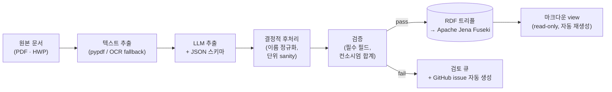
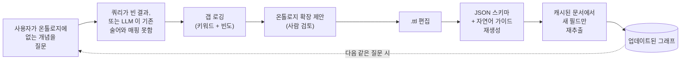

  

[이틀 전](),
오후 한나절을 들여 마크다운 기반의 개인 지식 베이스를 만들고 "이 정도면 됐다"고
정리했다. 폴더, 슬러그, 프론트매터, 어디에 무엇이 가야 할지 아는 작은 스킬까지.
그 부트스트랩은 정확히 의도한 대로 작동했다 - 그날 끝 무렵에는 cross-reference 가
실제로 쓸모 있게 느껴지기 시작할 정도의 콘텐츠가 쌓였다.

문제는, 부트스트랩 다음 날부터 진짜 질문을 던지기 시작했다는 점이다.
_특정 기관이 지원한 과제만 골라서 보여줘._ _누구와 같은 나라에 갔고, 그 시기에
그 사람은 어떤 과제에 참여하고 있었지?_ _수행 중인 모든 과제에 대한 우리 기관의
참여 분담금 합계는 얼마지?_ 어느 것이든 관계형 DB 에서는 한두 줄짜리 SQL 인데,
나는 마크다운 파일 무더기를 만들어 놓고 있었다. 그래서 오늘은 그 KB 를 진짜 질문에
답할 수 있는 것으로 옮기는 데에 시간을 썼고, 흥미로운 부분은 - 이번에도 - 타이핑이
아니라 결정들이었다.

가기 전에 한 가지. 개인 KB 로 출발한 이 일은, 문제들을 제대로 풀어가는 과정에서
작은 운영 시스템 쪽으로 미끄러져 왔다. 추출 파이프라인, 그래프 저장소, MCP 서버,
GitHub issue 큐, schema evolution 루프까지. 표면은 여전히 "메모를 좀 쓰고 있다"
처럼 보일지 모르지만 작업의 결은 달라졌다. 쓸 만한 KB 가 그 KB 의 질문들을 진지하게
받아들이기 시작하면 결국 이렇게 된다는 것에 대한, 정직한 인정이다.

## 왜 굳이

개인 KB 를 마크다운으로 두는 쪽의 논거는 정직함이다. 사람이 쓰고, 사람이 읽고,
에디터 하나로 루프가 닫힌다. 반면 KB 를 지식 그래프로 승격하는 쪽의 논거는,
**구조화된 답**이 필요해진 순간 - 카운트, 조인, 범위, 집계 - 마크다운은 잘못된
형태라는 점이다. 정규식으로 grep 하거나, 프론트매터에서 필드를 뽑아내는 작은
파서를 짜게 되는데, 그 시점에 이미 부서지기 쉬운 임시 쿼리 레이어 하나를 직접 짠
셈이 된다. 그래프는 그냥 _그 자체로_ 쿼리 레이어다. 진짜 질의 언어와 함께.

그래서 오늘의 목표는 마크다운을 유지하면서 - Obsidian 에서 읽는 그 표현은 그대로
두면서 - 그 아래에 두 번째 표현을 더하는 것이었다. 같은 콘텐츠가 환원될 수 있는
RDF 그래프, [Apache Jena Fuseki](https://jena.apache.org/documentation/fuseki2/)
위에 올라가서, 나든 MCP 서버를 통해 가리키는 어떤 어시스턴트든 질의할 수 있는
그런 레이어.

## 네 가지 아키텍처 결정

### 1. 마크다운을 SoT 로 둘 것인가, 온톨로지를 SoT 로 둘 것인가

첫 본능은 마크다운을 SoT 로 두고 그래프를 파생 view 로 다루는 것이다. 가장 저항이
적은 길이다. 마크다운이 이미 있고, 프론트매터 컨벤션도 이미 있고, 작은 스크립트
하나로 그걸 트리플로 펴낼 수 있다.

그 본능은 틀렸다. 변환 스크립트가 문제가 아니다. 문제는 마크다운 프론트매터가
**작성 시점의 작성자가 그때 그때 느낀 대로** 라는 점이다. 첫날, `role` 필드가
빈 문자열인 과제가 셋, "주관" 으로 적힌 게 또 셋 있었다. 스크립트는 양쪽 모두를
존중하려 했고, 결과적으로 같은 기관이 같은 과제의 주관이면서 동시에 일반 멤버라고
주장하는 트리플을 만들어냈다 - 그래프는 모순을 막을 이유가 없으니 그대로 받아
들였다. 그 이후의 모든 정리 작업이 같은 모양이었다. 마크다운이 SoT 로 쓰기엔 너무
느슨하고, 그래프가 그 모호함을 고스란히 상속받는다.

옳은 답은 - 향후 한 주에 걸쳐 옮길 방향은 - 뒤집는 것이다. 질의 레이어의 SoT 는
**온톨로지**. 그 온톨로지가 추출된 원본 **문서** - PDF, HWP, 스프레드시트 - 가
상위 SoT, canonical artifact 다. 마크다운은 사람의 눈을 위한 생성된 read-only
view 다. 사실이 바뀌어야 한다면 문서나 그래프에서 직접 바꾼다. 마크다운은 둘 모두의
하류다.

가혹하게 들리지만, 한 부류의 버그를 통째로 녹여버린다. 같은 기관명이 두 가지
정규화로 그래프에 들어갈 수 없다. 그래프를 만드는 코드가 `clean_org_name()` 을
단 한 번 호출하기 때문이다. 어느 기관이 어느 과제를 지원했는지를 사람이 일관성
없이 타이핑할 여지도 없다 - 그 필드가 평문으로 존재한 적이 없으니까.

### 2. "문서의 특성"이라는 게 정확히 무엇인가 - 그리고 어디에 표현할 것인가

여기서 두 레이어가 표현력에서 실제로 갈라진다. 정확히 짚을 가치가 있다. 마크다운
프론트매터도, OWL 온톨로지도, 둘 다 "과제의 특성"을 담을 수 있다. 다만 **방식**이
다르다.

마크다운 프론트매터는 **평탄한 key-value** 다. 과제 페이지에 `keti_pi` 필드가
이름 하나를 가진다. `consortium` 필드가 리스트를 가진다. `budget` 필드가 숫자
하나를 가진다. 여기까지는 괜찮다. 문제는 기록하고 싶은 관계가 _그 자신의 속성_ 을
가질 때다. 컨소시엄 멤버십은 단순히 "기관 X 가 컨소시엄에 있다" 가 아니라,
"기관 X 가 역할 Y 로 컨소시엄에 있고, 그쪽 책임자는 인물 Z 이고, 분담 예산은
W 원이다" 이다. 이걸 프론트매터에 펴내려 하면 `consortium: [{name, role, pi,
share}, …]` 가 된다 - 이미 구조화된 데이터로 한 발 들어선 모양이지만, YAML
파서가 강제할 수 없는 한 발이고, 다음에 그 파일을 편집할 사람이 조용히 다르게
적기 시작할 한 발이다.

온톨로지는 같은 사실을 작은 그래프로 모델링한다. Project 노드가 있고, 그것에
`hasConsortiumMembership` 으로 ConsortiumMembership 노드가 붙고, 그 Membership
노드가 자기 자신의 `memberOrg`, `memberRole`, `memberPI`, `memberBudgetShare` 를
가진다. 이게 **reification** - 관계를 사물로 만드는 것 - 이고, 평탄한 key-value
가 주지 못하는 걸 온톨로지가 준다. 대가는 verbosity 다. 얻는 건 "기관 X 가
지원하는 모든 과제에서 컨소시엄 PI 로 등장한 기관들이 어디인가" 같은 질문을
조인 로직을 직접 짤 필요 없이 던질 수 있게 되는 능력이다.

내가 지금 들고 있는 원칙: 관계가 자기 자신의 속성을 가지는 사실은 온톨로지에
속한다. 한 엔티티의 순수한 속성 - 이름, 날짜, 단일 숫자 - 인 사실은 어디든
편하게 살 수 있고, 그건 프론트매터로 충분하다.

### 3. 문서에서 그래프는 어떻게 뽑는가

솔직한 답: 언어 모델과 스키마로. 무거운 일은 스키마가 한다. 요즘의 LLM 은 JSON
스키마와 문서를 같이 받으면 놀라울 정도의 충실도로 스키마를 채운다 - **단,
스키마가 올바른 것을 잡을 만큼 표현력이 있고, 잘못된 것을 거부할 만큼 타이트할 때**.
오늘 시간의 대부분은 프롬프트가 아니라 스키마에 들어갔다.

최종 파이프라인은 이렇게 생겼다.

<small><em>드래그로 이동 · 스크롤로 확대</em></small>

LLM 우측의 두 박스가 하중을 받는 지점이다. LLM 은 그럴듯한 실수를 할 텐데,
후처리 규칙과 검증기가 그걸 그래프 도달 전에 잡기 위해 존재한다. 검토 큐는 두
레이어가 모두 놓친 경우의 비상구다. 그 케이스들은 작은 GitHub issue 로
프로젝트에 등록되고, 내 주의를 요구하는 건 오직 그것뿐이다.

### 4. 로컬 모델인가, 상용 모델인가

둘 다 써봤다. 내 쪽의 제약은 명확했다. 정액 Pro 티어의
[Claude](https://claude.ai) 를 쓰고 있고, Anthropic API 는 그 위에 별도 종량
과금이다. 개인 프로젝트에 종량 청구를 쌓을 의향이 없다. 즉 Anthropic API 를
**기본 추출기**로 쓰는 길은 막혔다 - 내가 접근할 수 있는 선택지 중 가장 정확함에도.
정말 중요한 문서 몇 건에 한해 가끔 쓰는 옵션으로만 남겼다.

기본은 로컬이어야 했다. 320억 파라미터 모델을 편하게 돌릴 만한 메모리가 있는
머신이 있고, [Ollama](https://ollama.com) 가 이미 깔려 있다. 질문은 어느 로컬
모델인가로 좁혀졌다.

로컬에는 문헌이 잘 말하지 않는 실제 비용이 있다. 좋은 로컬 모델도 상용 frontier
모델보다 변동이 크다. 호출당 더 오래 걸린다. 상용 모델이 절대 안 어기는 방식으로
스키마를 어길 때가 있다. 호출당 비용이 0 이라는 사실 하나가 이걸 견딜 만하게 만드는
유일한 이유다 - 그리고 일상적인 케이스에는 그게 충분한 이유다.

### 5. 온톨로지는 누가 관리하나

이건 하루에 세 번째 스키마를 고치고 나서야 진지하게 생각하기 시작한 질문이다.
온톨로지는 `.ttl` 파일 안에 있다. LLM 추출기는 온톨로지가 정의한 모든 속성을 알아야
한다 - 모르면 추출이 안 된다. MCP 서버 뒤의 자연어→SPARQL 헬퍼도 모든 속성을
알아야 한다 - 모르면 존재하지 않는 이름을 환각한다. 결국 속성 하나를 추가할
때마다 세 곳을 고치고 있었다. 온톨로지 파일, 추출기가 쓰는 JSON 스키마, 쿼리
헬퍼가 읽는 자연어 가이드.

세 번째 라운드 끝에 작은 생성기를 짰다. `.ttl` 파일이 이제 내가 편집하는 유일한
곳이고, JSON 스키마와 자연어 가이드는 둘 다 거기서 재생성된다. 쿼리 헬퍼는 매
호출마다 자연어 가이드를 다시 읽어서 어휘 변경에 MCP 서버 재시작이 불필요해졌다.
다음 단계는 추출기 스키마도 똑같이 만드는 것이다. 그러고 나면 정말로 온톨로지가
유일한 산출물이 된다 - 나머지는 전부 파생이다.

좀 더 깊은 이야기: 세 가지 표현을 손으로 동기화하는 온톨로지는 결국 표류하는
온톨로지다. 지속 가능한 모델은 **하나의 정본 표현 + 나머지를 만들어내는 빌드
단계** 뿐이다.

## 모델 비교

"로컬 모델은 받아들일 만하다" 라는 주장에 숫자를 붙여야 했다. 통제된 비교를 한 번
돌렸다. 한국어로 된 긴 기술 문서 한 건, 본문 약 23,000 자, 추출해야 할 구조화된
메타데이터는 - 식별자, 기간, 예산, 다기관 컨소시엄, 역할 배정. 같은 입력을 세 개의
서로 다른 추출기로 돌리고 출력을 필드 단위로 채점했다.

세 추출기:

- **Claude (세션 내).** 평소 쓰는 Anthropic 모델에 문서를 API 가 아니라 대화 안에서
  직접 건넨 경우. 과금 없음 - 비용이 Pro 구독에 분산된다. 단점은 인터랙티브이지
  파이프라인 부품이 아니라는 것.
- **`qwen2.5:32b` (로컬, Ollama 서빙).** 한국어를 잘 다루고 strict JSON 출력을
  존중하는 Alibaba 의 320억 파라미터 모델. Q4_K_M 양자화, 로컬 데몬으로 서빙.
- **`exaone3.5:32b` (로컬, Ollama 서빙).** 한국어에 최적화된 LG AI Research 의
  320억 파라미터 모델. 같은 양자화, 같은 서버.

스칼라 필드 15 개 (식별자, 기간, 이름, 예산, 역할) 와 구조화된 배열 (컨소시엄
멤버십, 연차별 예산) 을 채점했다. 결과 요약.

| 차원                               | Claude (세션) | `qwen2.5:32b` | `exaone3.5:32b`                        |
| ---------------------------------- | ------------- | ------------- | -------------------------------------- |
| ground truth 일치 (15 중)          | 15            | 9             | 8                                      |
| 잘못된 값 (오류)                   | 0             | 1 (기관 슬롯) | 3 (예산 단위, 주관 기관, 사업명)       |
| 스키마 지시 엄격 준수              | yes           | 대체로        | 플래그 변경 후                         |
| Ollama 네이티브 `format=json` 모드 | n/a           | 동작          | `{}` 만 반환 - free-text fallback 필요 |
| 문서당 소요 시간                   | 대화형        | 4분 39초      | 3분 30초                               |
| 문서당 비용                        | Pro 구독 포함 | 0             | 0                                      |
| 파이프라인 적합 (배치, 재현)       | no            | yes           | yes                                    |

몇 가지가 두드러진다.

Claude 는 _더 낫다_. 그런데 그 "더 낫다"는, 신중한 동료가 문서를 읽어주는 식으로
더 낫다는 의미다. 50 개 PDF 의 큐를 던질 대상은 아니다.

`qwen2.5:32b` 는 배치 추출기로서 진심 쓸 만하다. 헤드라인 실패는 미묘하다. 다기관
컨소시엄에서 자기 자신 - 정확히는 그 문서가 서술된 관점의 주체인 기관 - 을 컨소시엄
파트너 중 하나로 끼워 넣는다. 결정적 후처리로 잡을 수 있는 종류다 - alias 를
제거하고, 거기 묶여 있던 PI 를 다른 필드로 승격하는 30 줄 짜리 코드 - 그 코드를
한 번 쓰고 나면 모델은 충분히 쓸 만해진다. 나머지는 거의 다 맞춘다.

`exaone3.5:32b` 는 서프라이즈였다. 종이 위에선 한국어 전문가다. 실제로는, Ollama
의 strict `format=json` 모드에서 빈 객체 - 모든 필드 null - 를 반환했다. 원인은
정확히 그 한 플래그였다. strict-JSON 지시를 끄고 시스템 프롬프트의 스키마만으로
읽게 하니 합리적인 출력이 나왔다. 하지만 그렇게 살린 뒤에도 `qwen` 보다 한 단계
무거운 실패 모드가 있었다. 두 군데에서 컨소시엄의 주관 기관을 통째로 누락했고,
한 군데에서는 통화 단위를 천 배 오해했다. 주관 기관 누락은 `qwen` 의 문제와
대칭적인 형태라 흥미롭긴 하다. 단위 오류는 더 심각하다 - 자릿수 sanity 체크
없이는 하류의 무엇도 잡지 못한다.

솔직한 요약: 무인 파이프라인에는, strict JSON 을 깔끔하게 다루고 예측 가능한 실수
**하나**만 하는 작은 로컬 모델이 적절한 기본값이다. 첫 시도부터의 정확성이 정말로
중요한 케이스에 더 비싼 옵션을 아껴두면 된다.

## 스키마 진화 루프

가장 흥미로운 미해결 질문은, KB 가 온톨로지에 아직 모델링되지 않은 개념에 대해
질문 받을 때 무슨 일이 일어나야 하는가다. 예를 들어 쿼리 헬퍼에게
_사업화 계획이 있는 과제 보여줘_ 라고 묻는다고 하자. 온톨로지에는
`commercializationPlan` 속성이 없다. 헬퍼가 생성하는 SPARQL 은 빈 결과를
반환한다. 나는 결과를 보고 KB 가 불완전하다고 결론짓는다. 그리고 그냥 넘어가거나 -
더 좋게 - 온톨로지를 확장하고, 속성을 추가하고, 이미 가지고 있는 문서들에 대해
추출기를 다시 돌린다.

이 두 번째 길이 **스키마 진화 루프** 다. 정적 그래프를 살아있는 그래프로 만드는
바로 그 메커니즘이다:

이걸 어렵게 만드는 게 세 가지 있다. 첫째, 어떤 질문이 _기존 스키마의 희박한
부분_ 이 아니라 _진짜 갭_ 을 친 것인지 _감지_ 하기. 휴리스틱은 헬퍼가 생성한
SPARQL 을 보고 존재하지 않는 술어를 썼는지 확인하거나, 결과가 비었는데 질문의
키워드가 어떤 기존 술어의 레이블과도 매칭되지 않는지 검사하는 것이다. 둘째,
확장을 _책임 있게 제안_ 하기. LLM 이 키워드로부터 합리적인 클래스나 속성을 제안할
수 있지만, 큐레이션 없이 자라는 온톨로지는 일관성을 잃기 때문에 사람의 확인이
여전히 필요하다. 셋째, _새 것만 재추출_ 하기. 스키마가 바뀔 때마다 모든 문서에
대해 전체 추출을 돌리면 감당이 안 되므로, 캐시 키가 `(문서)` 가 아니라
`(문서, 필드)` 여야 한다.

아이디어로서는 새로울 게 없다. 드문 건, 이걸 일상 루프에 실제로 와이어업할 만큼
진지하게 다루는 것이다. 내가 거는 베팅은, 확장 비용이 싸게 유지된다면, 내 _실제
사용_ 이 온톨로지를 키워 나가는 동력이 된다는 것이다 - 내가 상상한 질문이 아니라
진짜 던진 질문에 의해.

## 운영 모델로서의 terminate-on-failure

일찍 결정했고 기록해 둘 가치가 있는 한 가지. 파이프라인이 특정 검증 실패에서 그냥
덮어쓰지 않고 **terminate** 한다. 추출기가 평균보다 두 자릿수 작은 예산을 반환하면,
파이프라인은 그 잘못된 숫자를 조용히 저장하지 않는다. 검토 폴더에 작은 JSON 을
하나 쓰고, 문제 문서의 슬러그와 실패한 구체적 체크를 담은 GitHub issue 를 열고,
멈춘다. 그래프는 마지막 known-good 상태로 남는다.

제약적으로 들린다 - 처음 며칠은 실제로 _제약적이었다_, 검증기가 필요 이상으로
엄격해서 풀어야 했다. 하지만 이건 LLM 기반 파이프라인의 최악의 실패 모드를
녹여버린다. 그 최악의 모드는, 그럴듯하게-잘못된 데이터가 천천히 쌓이다가 집계
쿼리가 살짝 어긋난 답을 줄 때 비로소 깨닫는 것이다. 헷갈리지만 명백히 틀리지는 않은
데이터는 데이터가 없는 것보다 나쁘다. 시스템 전체에 대한 신뢰를 깎기 때문이다.

운영 모델은 이렇다: _파이프라인은 절대 추측하지 않는다. 결정할 수 없을 때 묻는다._
Issue 가 묻는 메커니즘이다. 부수적으로 그건 완벽한 감사 로그이기도 하다 - 데이터의
모든 이상한 케이스가 closed 또는 open issue 로 남고, closing comment 가 내가
무엇을 어떻게 결정했는지 기록한다.

LLM 기반 시스템에서는 이게 옳은 기본값이라고 본다. 처리량 최적화는 조용한 fallback
값으로 유혹한다. 신뢰 최적화는 시끄러운 실패로 민다.

## 고찰, 그리고 추진 방향

예상하지 못한 게 몇 가지 있다.

**온톨로지는 작고, 그게 괜찮다.** 클래스 열 개, 속성 마흔네 개. 스키마 진화 루프가
요구하면 추가할 거고, 빌드 단계 덕분에 추가가 싸다. "처음부터 모든 걸 모델링하자"
는 본능은 내가 셀 수 있는 것보다 많은 KB 를 죽였다.

**한국어 차원이 생각보다 많이 작동한다.** 오늘의 어려운 문제 세 가지가 한국어
특유의 것이었다. 초기 SPARQL 의 절반을 깨놓은 문자열 리터럴의 언어 태그
(`@ko` 접미), 어떤 곳엔 법인 접두사 (`㈜`) 가 붙고 어떤 곳엔 안 붙는 기관명
정규화, 그리고 내가 깜빡하고 enum 에 넣지 않았던 값 ("신청중"). 어느 것도 깊은
문제는 아니지만, 예산하지 않은 하루치의 디버깅이 들었다.

**개인 KB 에서 운영 시스템으로의 표류는 실제였다.** 이 일은 개인 지식 베이스로
시작해서 작은 운영 시스템에 가까운 것이 되어 있다. 그게 나쁘다고 생각하진 않는다 -
"메모를 잘 쓰자" 가 아니라 "내가 유일한 사용자인 작은 내부 도구를 만들자" 라고
인정하면 된다는 뜻일 뿐이다.

다음 단계는 명확하다. 자연어 쿼리 헬퍼가 갭을 능동적으로 인식하도록 스키마 진화
루프를 완성한다. 파이프라인의 입력 경계를 폴더 워처로 옮겨서 PDF 를 클라우드
폴더에 떨어뜨리는 게 내가 해야 할 유일한 일이 되도록 만든다. 자동 재생성된
마크다운 view 를 신뢰하게 되는 순간, 손으로 쓴 마크다운 파일들을 그것으로 교체한다.

이번에도 가장 궁금한 건, 이게 내가 KB 에 **묻는** 질문의 결을 바꾸는가 다. 마크다운
KB 에서는 내 질문이 "X 에 관한 파일을 찾아줘" 모양이었다. Fuseki 위의 그래프에서는
"세어줘", "평균 내줘", "두 가지가 겹치는 곳을 보여줘" 가 될 수 있다. 그건 다른
종류의 유용함이다. 일주일 안에 알게 될 거다. 그게 내가 정말 원했던 종류인지.
