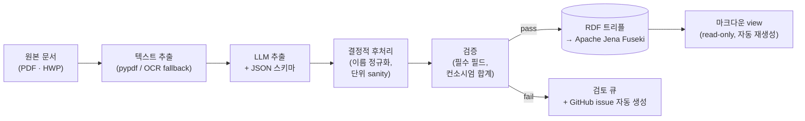
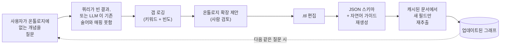

  

[이틀 전]() 에 오후
한나절을 들여 개인용 지식 베이스를 마크다운으로 하나 만들었다. 폴더, 슬러그,
프론트매터, 어디다 뭘 둘지 정해주는 작은 스킬까지. 부트스트랩으로는 잘 됐다.
하루가 끝날 즈음엔 cross-reference 가 살짝 쓸모 있게 느껴질 정도의 양은 채웠으니까.

문제는 다음날이었다. 진짜 질문을 던지기 시작하니까 금세 한계가 보였다.
"이 기관이 지원한 과제만 보여줘." "이 사람이랑 같이 그 나라 갔던 거 언제지, 그때
무슨 과제였더라?" "올해 수행 중인 과제에서 우리 분담금 합계가 얼마지?" 관계형
DB 였으면 SQL 두 줄로 끝날 질문들인데, 내 손에는 마크다운 파일 더미가 있었다.
그래서 오늘은 그걸 진짜 질문에 답할 수 있는 모양으로 옮기는 데 하루를 썼다.
이번에도 재밌었던 건 타이핑보다는 결정들이었다.

가기 전에 한 가지. 개인 KB 로 시작한 이 일은, 문제들을 제대로 풀어나가다 보니
어느새 작은 운영 시스템 비슷한 게 돼버렸다. 추출 파이프라인이 있고, 그래프
저장소가 있고, MCP 서버가 있고, GitHub issue 큐가 돌고, 스키마가 자가 진화한다.
겉으로는 여전히 "메모 좀 쓰고 있어요" 같아 보일지 몰라도, 작업의 결은 분명히
달라졌다. 솔직히 말하자면 KB 가 자기 질문을 진지하게 받기 시작하면 결국 이렇게
된다는 걸 이번에 알게 됐다.

## 왜 굳이

마크다운 KB 의 장점은 정직함이다. 사람이 쓰고, 사람이 읽고, 에디터 하나면 끝.
KB 를 지식 그래프로 올리는 쪽의 논거는 그 반대편에 있다. 구조화된 답이 필요한
순간 - 카운트, 조인, 범위, 집계 - 마크다운은 잘못 고른 도구라는 거다. 결국
정규식으로 grep 하거나, 프론트매터에서 필드 뽑는 작은 파서를 직접 짜게 되는데,
그쯤 되면 임시 쿼리 레이어 하나를 손으로 만들고 있는 셈이다. 그래프는 그 쿼리
레이어를 기본으로 갖고 시작한다. 진짜 질의 언어까지 딸려서.

그래서 오늘 목표는 단순했다. 마크다운은 그대로 둔다 - Obsidian 에서 읽는 그건
유지하고 싶다. 다만 그 밑에 두 번째 표현을 깐다. 같은 콘텐츠를 환원할 수 있는
RDF 그래프를 [Apache Jena Fuseki](https://jena.apache.org/documentation/fuseki2/)
에 올리고, 나든 MCP 서버를 통해 가리키는 어떤 어시스턴트든 거기에 SPARQL 을
던질 수 있도록.

## 네 가지 아키텍처 결정

### 1. 마크다운이 SoT 인가, 온톨로지가 SoT 인가

첫 본능은 마크다운을 SoT 로 두고 그래프는 파생 view 로 다루는 거다. 저항이
제일 작은 길이니까. 마크다운은 이미 있고, 프론트매터 규칙도 있고, 작은 스크립트
하나로 트리플로 펴낼 수 있다.

근데 그게 잘 안 됐다. 변환 스크립트가 문제가 아니다. 문제는 프론트매터가 결국
"그날 그 사람이 그렇게 쓰고 싶었던 대로" 라는 점이다. 첫날 보니까 `role` 필드가
빈 문자열인 과제가 셋, "주관" 으로 적힌 게 또 셋이었다. 스크립트는 양쪽을 다
존중하려고 했고, 그 결과 같은 기관이 같은 과제의 주관이면서 동시에 일반 멤버라고
주장하는 트리플이 만들어졌다. 그래프는 모순을 막을 이유가 없으니 그대로 받았다.
그 이후 정리 작업 거의 다가 비슷한 모양이었다. 마크다운이 SoT 로 쓰기엔 너무
느슨하고, 그래프는 그 느슨함을 그대로 받아들였다.

그래서 결국 뒤집기로 했다. 질의 레이어의 SoT 는 온톨로지. 그 온톨로지가 추출된
원본 문서 - PDF, HWP, 스프레드시트 - 가 상위 SoT, canonical artifact 다.
마크다운은 사람이 읽기 위한 read-only view 로 내려간다. 사실이 바뀌어야 하면
문서나 그래프를 바꾼다. 마크다운은 둘 다의 하류다.

말로 하면 좀 매정하게 들리는데, 한번 적용하면 버그 한 부류가 그냥 사라진다.
같은 기관명이 두 가지로 정규화되어 그래프에 들어갈 일이 없다. `clean_org_name()`
을 코드가 정확히 한 번 호출하니까. 어느 기관이 어느 과제를 지원했는지 사람이
일관성 없이 타이핑할 여지도 없다. 그 필드가 평문으로 존재한 적이 없으니까.

### 2. "문서의 특성" 이라는 게 뭔데, 어디에 적을 건데

여기서 두 레이어가 표현력이 갈라진다. 한번 정확히 짚어두고 싶다. 마크다운
프론트매터도, OWL 온톨로지도, "과제의 특성" 을 담을 수는 있다. 다만 담는 방식이
다르다.

프론트매터는 평탄한 key-value 다. 과제 페이지에 `keti_pi` 가 이름 하나를 가진다.
`consortium` 이 리스트 하나를 가진다. `budget` 이 숫자 하나를 가진다. 이까진
괜찮다. 문제가 생기는 건 적고 싶은 _관계_ 가 자기 속성을 갖고 있을 때다. 컨소시엄
멤버십이 그 예다. "기관 X 가 컨소시엄에 있다" 가 아니라 "기관 X 가 역할 Y 로
컨소시엄에 있고, 그쪽 책임자는 인물 Z 고, 분담 예산은 W 원이다." 이걸 프론트매터에
펴려면 결국 `consortium: [{name, role, pi, share}, …]` 같은 모양이 된다. 한 발은
이미 구조화된 데이터 쪽으로 내디딘 모양인데, YAML 파서가 이걸 강제할 수 없고,
다음에 그 파일 손대는 사람이 슬쩍 다르게 적기 시작할 한 발이다.

온톨로지는 같은 사실을 작은 그래프로 모델링한다. Project 노드가 있고, 거기에
`hasConsortiumMembership` 으로 ConsortiumMembership 노드가 붙고, 그 Membership
노드가 자기 자신의 `memberOrg`, `memberRole`, `memberPI`, `memberBudgetShare`
를 가진다. 이걸 reification 이라고 부른다. 관계를 사물로 만드는 거. 평탄한
key-value 가 못 주는 걸 이게 준다. 대가는 좀 verbose 해진다는 거. 얻는 건
"기관 X 가 지원한 모든 과제에서 컨소시엄 PI 로 등장한 기관이 어디인가" 같은
질문을 조인 로직 직접 짤 필요 없이 던질 수 있게 되는 능력.

기준을 하나 정했다. 관계가 자기 속성을 가지면 온톨로지에 적는다. 한 엔티티의
순수 속성 - 이름, 날짜, 단일 숫자 - 은 어디든 편한 쪽에 적고, 그건 프론트매터로
충분하다.

### 3. 문서에서 그래프는 어떻게 뽑나

LLM 한테 스키마랑 같이 던지면 된다. 짧게 말하면 그렇다. 무거운 일은 스키마가
한다. 요즘 LLM 은 JSON 스키마하고 문서를 같이 받으면 꽤 충실하게 채워준다.
다만, 스키마가 올바른 걸 잡을 만큼 표현력 있고 잘못된 걸 막을 만큼 타이트해야
한다. 오늘 시간의 대부분은 프롬프트가 아니라 스키마에 들어갔다.

결과적으로 쓰는 파이프라인:

<small><em>드래그로 이동 · 스크롤로 확대</em></small>

LLM 오른쪽의 두 박스가 중요한 부분이다. LLM 은 그럴듯한 실수를 한다.
후처리 규칙이랑 검증기는 그 실수를 그래프 도달 전에 잡으려고 있는 거다. 검토
큐는 둘 다 못 잡은 경우 빠져나가는 출구다. 그런 케이스들은 작은 GitHub issue
로 등록되고, 내가 봐줘야 할 건 그것뿐이다.

### 4. 로컬 모델, 상용 모델

둘 다 해봤다. 제약은 분명했다. 정액 Pro 티어로 [Claude](https://claude.ai)
를 쓰고 있는데, Anthropic API 는 그 위에 별도 종량으로 과금된다. 개인
프로젝트에 종량 청구를 쌓고 싶지는 않았다. 그 시점에 Anthropic API 를 기본
추출기로 쓰는 길은 막혔다. 가장 정확한 옵션인 걸 알면서도. 진짜 중요한 문서
몇 건에만 가끔 쓰는 용으로 남겼다.

기본은 로컬이어야 했다. 다행히 메모리 넉넉한 머신이 있고
[Ollama](https://ollama.com) 도 이미 깔려 있었다. 질문은 어느 로컬 모델이냐로
좁혀졌다.

로컬에는 보통 잘 안 다뤄지는 비용이 있다. 좋은 로컬 모델도 상용 frontier
모델보다 변동이 크다. 호출이 느리다. 가끔 상용 모델은 절대 안 하는 방식으로
스키마를 어긴다. 호출당 비용이 0 이라는 사실 하나가 이걸 견디게 해준다.
일상적인 케이스에는 그걸로 충분하다.

### 5. 온톨로지는 누가 관리하나

이건 하루에 세 번째로 스키마 고치고 나서야 진지하게 생각하기 시작한 질문이다.
온톨로지는 `.ttl` 파일이다. LLM 추출기는 거기 정의된 속성을 알아야 한다.
모르면 안 뽑는다. MCP 서버 뒤의 자연어→SPARQL 헬퍼도 마찬가지다. 모르면
없는 이름을 환각한다. 즉 속성 하나 추가할 때마다 세 군데를 고치고 있었다.
온톨로지 파일, 추출기가 쓰는 JSON 스키마, 쿼리 헬퍼가 읽는 자연어 가이드.

세 번째 라운드 끝에 작은 생성기를 짰다. 이제 `.ttl` 파일이 내가 손대는 유일한
곳이고, JSON 스키마랑 자연어 가이드는 거기서 자동으로 만들어진다. 쿼리 헬퍼는
매 호출마다 자연어 가이드를 다시 읽도록 했다. MCP 서버 재시작 없이 어휘 변경이
반영된다. 다음은 추출기 스키마도 같은 식으로 만드는 거. 그러고 나면 정말로
온톨로지가 유일한 산출물이 된다. 나머지는 다 파생.

좀 더 일반화해서 말하면, 세 군데를 손으로 동기화하는 온톨로지는 결국 표류한다.
지속 가능하려면 정본 표현 하나에 나머지를 빌드하는 단계가 있어야 한다.

## 모델 비교

"로컬 모델도 쓸 만하다" 라는 주장에 숫자를 붙여야 했다. 통제된 비교를 한
번 돌렸다. 한국어 긴 기술 문서 한 건, 본문 약 23,000 자, 뽑아야 할 메타데이터는
식별자, 기간, 예산, 다기관 컨소시엄, 역할 배정. 같은 입력을 세 추출기로
돌리고 필드별로 채점했다.

세 추출기:

- **Claude (세션 내).** 평소 쓰는 Anthropic 모델한테 문서를 API 가 아니라
  대화 안에서 직접 넘긴 경우. 과금 없음 - 비용이 Pro 구독에 묻혀 있다. 단점은
  인터랙티브라는 거. 파이프라인 부품은 아니다.
- **`qwen2.5:32b` (로컬, Ollama).** Alibaba 의 320 억 파라미터 모델. 한국어를
  잘 다루고 strict JSON 출력도 존중한다. Q4_K_M 양자화, 로컬 데몬으로 서빙.
- **`exaone3.5:32b` (로컬, Ollama).** LG AI Research 의 320 억 파라미터 모델.
  한국어에 최적화돼 있다. 같은 양자화, 같은 서버.

스칼라 필드 15 개 (식별자, 기간, 이름, 예산, 역할) 와 구조화된 배열
(컨소시엄, 연차별 예산) 을 채점했다. 결과:

| 차원                         | Claude (세션) | `qwen2.5:32b` | `exaone3.5:32b`    |
| ---------------------------- | ------------- | ------------- | ------------------ |
| 정답 일치 (15 중)            | 15            | 9             | 8                  |
| 잘못된 값                    | 0             | 1             | 3                  |
| 스키마 지시 엄격 준수        | 예            | 대체로        | 플래그 끄고 나서야 |
| Ollama 의 `format=json` 모드 | n/a           | 동작          | `{}` 만 반환       |
| 문서당 시간                  | 대화형        | 4 분 39 초    | 3 분 30 초         |
| 문서당 비용                  | Pro 구독 포함 | 0             | 0                  |
| 파이프라인 친화 (배치, 재현) | 아니오        | 예            | 예                 |

몇 가지가 눈에 띈다.

Claude 는 더 낫다. 다만 그 "더 낫다" 는 신중한 동료가 문서를 대신 읽어주는
느낌이다. 50 개 PDF 큐를 던질 대상은 아니다.

`qwen2.5:32b` 는 배치 추출기로 진심 쓸 만하다. 헤드라인 실패가 좀 미묘한데,
다기관 컨소시엄에서 자기 자신, 그러니까 그 문서가 쓰여진 관점의 주체인 기관을
컨소시엄 파트너 중 하나로 끼워 넣는다. 결정적 후처리로 잡을 수 있는 종류다.
alias 떼어내고, 거기 묶여 있던 PI 를 다른 필드로 올린다. 그 코드 30 줄 한
번 쓰고 나면 그 다음은 쓸 만하다. 나머지는 거의 다 맞춘다.

`exaone3.5:32b` 는 의외였다. 종이상으론 한국어 전문가일 텐데, 실제로는 Ollama
의 strict `format=json` 모드에서 빈 객체만 던진다. 모든 필드가 null. 원인은
정확히 그 플래그 하나였다. strict-JSON 끄고 시스템 프롬프트의 스키마만으로
읽게 하니 그제서야 멀쩡한 출력이 나왔다. 그런데 그렇게 살린 다음에도 `qwen`
보다 한 단계 더 무거운 실수가 있었다. 두 군데에서 주관 기관을 컨소시엄에서
통째로 빼먹었고, 한 군데에서는 통화 단위를 천 배 잘못 읽었다. 주관 빼먹는
건 `qwen` 의 실수랑 대칭이라 좀 재밌긴 하다. 단위 오류는 더 골치 아프다.
자릿수 체크 없이는 하류에서 아무도 못 잡는다.

요약하자면, 무인 파이프라인에는 strict JSON 도 깨끗하게 다루고 실수가 한
가지로 예측 가능한 작은 로컬 모델이 기본값으로 적당하다. 비싸고 정확한 옵션은
첫 시도부터 맞춰야 하는 케이스에만 쓰면 된다.

## 스키마 진화 루프

가장 흥미로운 미해결 질문은, 온톨로지가 아직 모델링 안 한 개념을 KB 에 물었을
때 무슨 일이 일어나야 하느냐다. 예를 들어 쿼리 헬퍼한테 "사업화 계획 있는
과제 보여줘" 라고 묻는다고 치자. 온톨로지에 `commercializationPlan` 이라는 게
없다. 헬퍼가 만든 SPARQL 은 빈 결과를 돌려준다. 결과 보고 나는 KB 가 부족하다고
판단한다. 그냥 넘어가거나, 더 나은 쪽으로는, 온톨로지를 확장하고 속성을
추가하고 이미 있는 문서들에 대해 추출을 다시 돌린다.

이 두 번째 길이 스키마 진화 루프다. 정적 그래프를 살아있게 만드는 메커니즘:

이걸 어렵게 만드는 게 세 가지 있다. 첫째, 질문이 _진짜 갭_ 을 찌른 건지
그냥 기존 스키마의 희박한 영역인 건지 가려내기. 휴리스틱은 헬퍼가 만든
SPARQL 에서 없는 술어를 썼는지 보거나, 결과가 비었는데 질문의 키워드가
어떤 기존 술어의 라벨과도 매칭이 안 되는지 보는 거다. 둘째, 확장을 _책임지고_
제안하기. LLM 이 키워드로부터 그럴듯한 클래스나 속성을 제안할 수는 있는데,
큐레이션 없이 자라는 온톨로지는 어느 순간 일관성을 잃는다. 그래서 사람 확인이
필요하다. 셋째, _새 것만 재추출_ 하기. 스키마 한 번 바뀔 때마다 모든 문서를
전체 추출 돌리면 비용이 감당이 안 된다. 캐시 키가 `(문서)` 가 아니라
`(문서, 필드)` 여야 한다.

아이디어로서 새로운 건 없다. 드문 건 이걸 일상 루프에 실제로 와이어업할 만큼
진지하게 다루는 거다. 내가 거는 베팅은, 확장이 싸게 유지되면 내 실제
사용이 온톨로지를 키워나갈 거라는 거. 내가 머릿속에서 상상한 질문이 아니라
실제로 던진 질문이 동력이 되도록.

## 운영 모델: terminate-on-failure

일찍 정하고 기록해두고 싶은 게 하나 있다. 파이프라인이 특정 검증 실패에서
그냥 덮어쓰지 않고 멈춘다. 추출기가 평균보다 두 자릿수 작은 예산을 던지면
파이프라인은 그 잘못된 숫자를 조용히 저장하지 않는다. 검토 폴더에 작은 JSON
하나 쓰고, 문제 문서의 슬러그랑 어떤 체크가 깨졌는지 담아 GitHub issue 를
열고, 멈춘다. 그래프는 마지막 known-good 상태로 남는다.

처음 며칠은 좀 답답했다. 검증기가 필요 이상으로 빡빡해서 풀어줘야 했다. 근데
이게 LLM 기반 파이프라인의 최악의 실패를 막아준다. 그 최악은 그럴듯하게-잘못된
데이터가 천천히 쌓이다가, 집계 쿼리가 살짝 어긋난 답을 줄 때 비로소 깨닫는
거다. 헷갈리는데 명백히 틀리진 않은 데이터는 데이터가 없는 것보다 나쁘다.
시스템 전체에 대한 신뢰를 깎아먹는다.

운영 모델은 한 줄로 정리된다. 파이프라인은 추측하지 않는다. 결정 못 하면
묻는다. Issue 가 묻는 메커니즘이다. 부수 효과로 완벽한 감사 로그가 된다.
데이터의 이상한 케이스가 죄다 closed 혹은 open issue 로 남고, closing comment
에 내가 뭐 결정했는지가 적힌다.

LLM 기반 시스템에서는 이게 맞는 기본값이라고 본다. 처리량을 최적화하면 조용한
fallback 으로 흐른다. 신뢰를 최적화하면 시끄러운 실패로 간다.

## 정리

생각보다 안 그랬던 게 몇 가지 있다.

온톨로지는 작고, 그게 괜찮다. 클래스 10 개, 속성 44 개. 스키마 진화 루프가
요구하는 만큼 늘릴 거고, 빌드 단계 덕에 늘리는 게 싸다. "처음부터 다 모델링하자"
는 본능이 지금까지 죽인 KB 가 셀 수 없을 정도다.

한국어 차원이 생각보다 많이 작동했다. 오늘 어려웠던 문제 셋이 한국어 특유의
거였다. 초기 SPARQL 절반을 깨놓은 문자열 리터럴의 언어 태그 (`@ko`),
어디엔 `㈜` 가 붙고 어디엔 안 붙는 기관명 정규화, 그리고 깜빡하고 enum 에
안 넣었던 값 ("신청중"). 어느 것도 깊은 문제는 아닌데, 하루치 디버깅이 들었다.
예산에 안 잡아둔 시간이었다.

개인 KB 에서 운영 시스템으로 미끄러진 건 실제 있었다. 개인 지식 베이스로
시작했는데 어느새 작은 운영 시스템 비슷한 게 됐다. 나쁘게 보진 않는다.
"메모를 잘 쓰자" 가 아니라 "내가 유일한 사용자인 작은 내부 도구를 만들자" 라고
인정하면 되는 거다.

다음은 분명하다. 자연어 쿼리 헬퍼가 갭을 능동적으로 알아채도록 스키마 진화
루프를 마무리한다. 파이프라인 입력 쪽을 폴더 워처로 옮겨서, 클라우드 폴더에
PDF 떨어뜨리는 게 내가 해야 할 유일한 일이 되도록 한다. 자동 재생성된 마크다운
view 가 믿을 만해지면 손으로 쓴 마크다운들을 그걸로 교체한다.

이번에도 제일 궁금한 건 이게 내가 KB 에 _묻는_ 질문의 결을 바꾸느냐다.
마크다운 KB 에서 내 질문은 보통 "X 관련 파일 찾아줘" 모양이었다. Fuseki 위의
그래프에서는 "세어줘", "평균 내줘", "두 가지가 겹치는 데 보여줘" 가 될 수
있다. 다른 종류의 유용함이다. 일주일이면 알 거다. 그게 내가 정말 원했던 종류인지.
