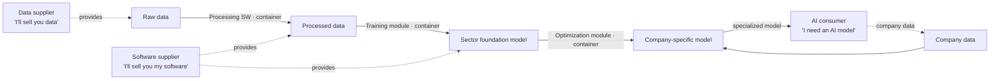

<small><em>한국어 버전: <a href="{{ '/blog/ko/industrial-ai-data-factory/' | relative_url }}">산업 AI를 위한 Industrial Data Lake 구상</a></em></small>

## The problem

The appetite for industrial foundation models keeps growing. Every shop floor
has the same quiet wish — "if only there were a good base model tuned to *our*
process." But the moment you try to build one, industry runs straight into a
pair of **conflicting requirements**.

On one side is the fear of leaking a data asset. In consumer AI, data is fuel:
the more you have, the better. On a factory floor, data *is* the competitive
edge. "Hold it in a 300°C chamber for two hours, then laser-cut at 90% power,
12 mm/s, with air blowing" — a single line of process parameters like that is
knowledge a company spent years accumulating. On the other side is a [**floor-
lifting**]({{ '/blog/2026/foundation-ai-for-industry/' | relative_url }}) effect I
noted in an earlier post. Once a good foundation model is out, the performance
floor for the whole sector rises with it, and the lead a company bought with its
own data gets shaved down. The conclusion sounds like a contradiction: everyone wants a
good foundation model, yet nobody wants to share the data and models it would
take to build one.

A third pressure stacks on top. As AI gets more capable, it also gets more
complex to assemble and run — which makes it steadily harder for an industrial
company to develop and operate AI on its own. So the real question becomes: **how
should data and AI models actually be operated?** That is where this sketch
starts.

## Agentic AI as an answer

Agentic AI offers one way out of the bind. The key move is to *give up* on the
"model that does everything." Instead you place a **generative AI that
understands context** at the center. The agent knows the context of the
industrial data, and for a given situation it works out **which tools to call**.
It is less an all-knowing brain than a coordinator that reads context and routes
to the right instrument.



The foundation model can then be put to work in two ways.

- **Internalize it through fine-tuning** — fine-tune a specific industry's
  context directly into the foundation model, so the knowledge is baked into the
  weights.
- **Attach it as a tool** — connect interpretation tools grounded in specific
  industrial knowledge, and pull that knowledge in from the outside as needed.

A consumer picks between the two depending on the situation, and the trade-off is
clear. Internalizing knowledge in the model costs a lot to train and keeps
costing to maintain afterward. Bolting tools onto an existing foundation model,
by contrast, allows flexible responses through those tools — but demands a much
wider set of management techniques to keep them in order.

| Approach | Strength | Cost to weigh |
| --- | --- | --- |
| Fine-tuning the foundation model (internalize) | Knowledge fused into the model, consistent answers | High training cost + ongoing maintenance |
| Tool connection (external knowledge) | Flexible responses, easy to refresh knowledge | Broad management techniques for tools and calls |

So the answer is probably not a fixed choice between the two but a
**multi-agent** arrangement rather than a single agent. When several agents each
own a slice of context and a set of tools, the system can compose the right
technique for the moment on the fly.

Now put that agent and foundation model on top of a system that makes data and
models *tradable without ever disclosing them*. What follows is that system,
organized under the name **Industrial Data Lake**. It is still a bundle of ideas
at the planning stage — closer to "this shape might work" than a settled design.

## What we're building

Stated plainly, the goal is this: secure the data needed to apply robots and AI
across the industries, and bring it all the way to a form you can
train on directly. The system provides roughly three things.

- **Data acquisition** — collect raw data coming off the industries.
- **AI-ready data** — process raw data into a form you can feed into training
  right away.
- **Training infrastructure** — provide the compute (GPUs and so on) needed to
  train.

One question left open here is whether the system should also own the model-
training tooling, or whether consumers bring their own. It decides where the
system's boundary gets drawn, so it is worth flagging on its own.

## Stakeholders and the business model

Four kinds of actors move the Industrial Data Lake, each putting something in and
taking a fee in return.

| Actor | What they offer | Charging |
| --- | --- | --- |
| Data provider | Raw data | Earns a data usage fee |
| Data processor | Software/converters that turn raw data into valid AI-ready data (quality control included) | Earns a software usage fee |
| Model developer | A foundation (base) model trained on the data | Pays for data, earns a model usage fee |
| Data consumer | (A site that wants to improve its own manufacturing with AI) | Pays for data and processing, gets a tuned specialized model |

Underneath it all, an actor holding data-security technology props up the whole
system. Seen as one line, the value chain flows data provider → data processor →
model developer → AI consumer, with "data / software / model" handed forward at
each arrow and "usage fees" flowing back the other way. On the consumer end, they
feed in their own private data (for a fee), get feedback, and walk away with a
specialized model.

The crux is that **nowhere along this chain is the original data or model
disclosed as-is**. What gets traded is usage rights and outputs — never the asset
itself.

## The processing flow

The path from data to a specialized model is cut into container-sized stages.
Because each stage is an independent container, a supplier can take part in the
chain without handing over its whole asset — data or software.

Three players meet on this flow, each with their own motive. The data supplier
says "I'll sell you data," the software supplier says "I'll sell you my
software," and the AI consumer says "I need an AI model." The Industrial Data
Lake is, in effect, the place where those three motives connect through trade
without exposing one another's assets.

## What Germany and Europe's IPCEI-AI suggests

This sketch borrows from Germany and Europe's IPCEI-AI strategy, and its
industrial foundation-model strategy in particular. Three takeaways compress out
of it.

First, **nobody wants to disclose their own competitive edge.** Unlike consumer
AI, industrial AI is tied to a company's survival, so any business model that
presumes data sharing fails from the start. The business model itself has to be
different from consumer AI.

Second, **the government's role stops at "up to the sector foundation model."**
Public money invests in sector-level foundation models that understand a sector's
context, but building a particular company's specialized model on top of that is
left to the individual firm.

Third, and this is what makes the idea interesting, the **sector foundation
model**. The point is not to build an omnipotent model that does everything, but
to have the public provide only the **foundation** on which each player can stack
something of their own. The line between where the public is involved and where
it hands off to the private sector is drawn right here.

## Public domain vs. private domain

Translate those takeaways into a system design and you get a picture that splits
assets into two layers.

| Layer | What | Where it lives |
| --- | --- | --- |
| **Public-supported domain** | Data, processing software, sector foundation model | Lives *inside* the system but is not disclosed. It is what gets charged for. |
| **Private domain** (no public support) | Private data, training module, private specialized model | Lives *outside* the system. Not disclosed even inside it, and its security is guaranteed. |

The point is that "inside the system" and "disclosed" are two different things.
Even publicly supported assets stay protected inside the system with only the
billing exposed, while private assets sit entirely outside the system and are
still guaranteed security.

## Security functions the system has to carry

For the no-disclosure principle to hold, technology has to back it up. Two
strands are on the table as functions inside the system.

**Data and model safety specs.** On the data side, metrics like uncertainty
quantification and resistance to jailbreaks; on the model side, watermarking
against distillation and irreversible-training techniques. The idea is to keep a
quantitative "how safe is this" attached to an asset as it flows down the chain.

**Manifest-based training-pipeline management (AI Manifest / AI-BOM).** Record,
as a spec, which techniques were applied at each stage and what the data/model
quality was, so you can **trace which data a model came from and how it was
processed.** Various metrics — incompleteness, prompt safety, and so on — get
folded in, and when a model version changes, that change history is tracked and
managed too. How far to pull in the S-BOM concept from software supply chains is
left as a question to weigh further.

## Wrap-up

Compressed to a sentence, the Industrial Data Lake is a **trade-and-security
system that makes industrial AI development possible on the premise of protecting
data and models as assets.** Because the consumer-AI grammar of disclose-by-
default breaks when you carry it onto a factory floor, the business model trades
usage rights and outputs instead of originals, the public role is drawn at the
sector foundation model, and the provenance and safety of assets are traced
end-to-end with an AI-BOM.

Plenty of question marks remain — whether the system should own the training
tools, how far to fold in S-BOM, how to pin down the scope of the 
industries and robot-AI deployment. Even so, the one axis is clear — *make AI
while keeping the assets protected* — and the rest can be stacked on top of that.
